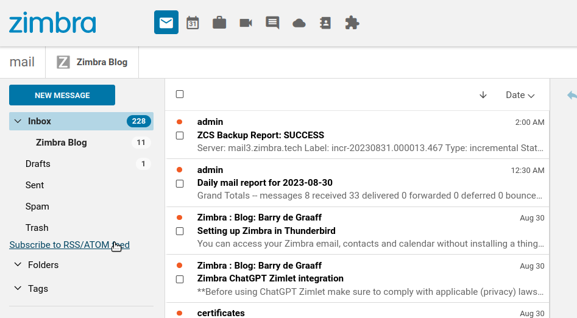
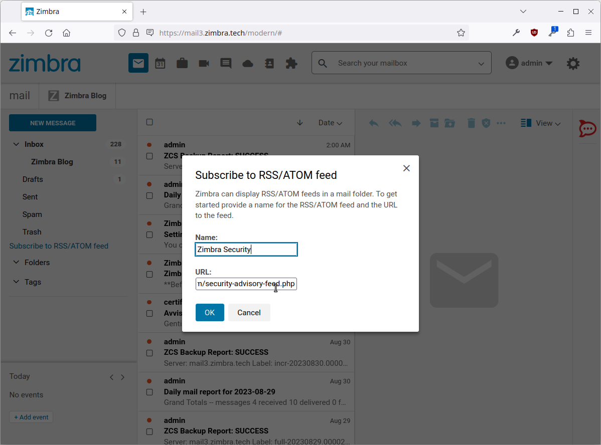
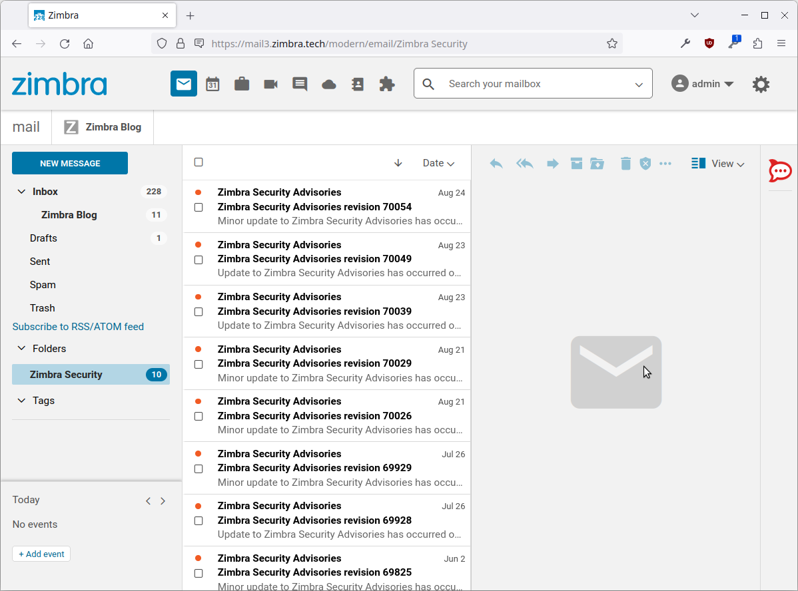

# Zimbra RSS ATOM Zimlet

A Simple Zimlet that ca nbe used to subscribe to RSS/ATOM feeds from within Zimbra Modern UI.

## Screenshots

Once installed a new option is shown in the folder list:


Then a name and URL for the RSS/ATOM feed can be provided:


The RSS/ATOM feed shows up as a folder in Zimbra:


## Installation

You can install the Zimlet by running the following commands as root:

```
wget https://github.com/Zimbra/zimbra-zimlet-rssfeed/releases/download/0.0.1/zimbra-zimlet-rssfeed.zip -O /tmp/zimbra-zimlet-rssfeed.zip
sudo su - zimbra
zmzimletctl deploy /tmp/zimbra-zimlet-rssfeed.zip
zmmailboxdctl restart
```
